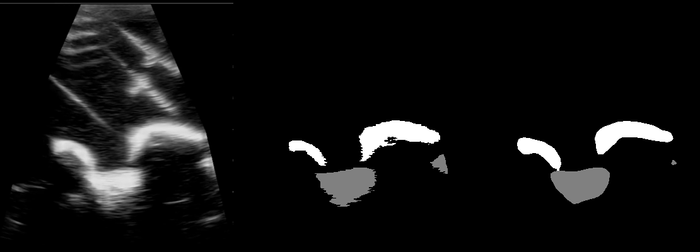

# SonoGravity

The present repository contains frameworks to train, evaluate and predict/segment grayscale images using U-Net and DeepLabV3 Convolutional Neural Networks (CNNs).
The code presented in this repository was developed and used in the MSc Biomedical Engineering dissertation: "Ultrasound-Guided Lumbar Puncture with AI-Based Image Labelling for Intracranial Pressure Assessment in Spaceflight", which aimed to label Longitudinal Spinal Ultrasound images in real-time to be incorporate in a novel and safer Lumbar Puncture technique to assess the Intracranial Pressure in a microgravity environment onboard the International Space Station.
This README provides guidance to train and predict a set of data.

## How to perform the segmentation:

### Step 1: Upload Dependencies
- CUDA 11.7 and PyTorch 1.13 or later and compatible versions of both CUDA and Pytorch must be installed;
- Further dependencies must be installed by running the following comand line:
```bash
pip install torch torchvision tqdm openpyxl numpy Pillow
```
### Step 2: Upload Your Data
Create a folder. Inside that folder, create two more folders for the images and for its respective Ground-truth masks.
The image and its respective mask **MUST** have exactly the same file name.

In the training process, additional data must be introduced to the validation phase. Therefore, another folder with the same characteristics as the one mentioned before must be created to introduce the validation data inside.

Considering that data from a Phantom and Human volunteers were used in this study, only the phantom data is available in the Data folder. The ultrasound files and respective ground-truth masks are represented in a .pth file. It was considered a total of 14 subjects for the phantom images. Although only one phantom model was used, 14 subjects were considered to the frames which were collected in different days, by different operators and in different angles and probe's positions.

The choice of Training and Validation data was made as a 80%/20% distribution, regarding the "subjects". Therefore, the data from the same subject is not in the Training and Validation simultaneously.

### Step 3: Frameworks adaptation
The code is adapted to greyscale data, therefore if the data aimed to be segmented has a 3-color channel, scripts must be modified, specifically in the lines:
- U-Net:
  
This portion 
```bash
model = UNet(n_channels=1, n_classes=args.classes, bilinear=args.bilinear)
```
must be modified to:
```bash
model = UNet(n_channels=3, n_classes=args.classes, bilinear=args.bilinear)
```
- DeepLab:
  
This portion
```bash
model.backbone.conv1 = nn.Conv2d(1, 64, kernel_size=(7, 7), stride=(2, 2), padding=(3, 3), bias=False)
```
must be modified to
```bash
model.backbone.conv1 = nn.Conv2d(3, 64, kernel_size=(7, 7), stride=(2, 2), padding=(3, 3), bias=False)
```
or simply deleted, since DeepLabV3 Pytorch accepts data with 3-color channels by default.

### Step 3: Train

Both scripts train.py inside U-Net and DeepLab folders must be used in the training process.
Scripts have comments to guide some of the steps mentioned in this guide.

The directories with the files must be introduced in the train.py scripts. Also, a directories to save the checkpoint, the worksheet with the validation metrics calculated per epoch, and the predicted images must also be introduced.
The checkpoints saved during the training are .pth files, which contain the models' weight updates. They are saved per 5 epoch, but this can be altered in the script.

If it is intended to be used DeepLab with ResNet-101 instead of ResNet-50 backbone, the code line:
```bash
model = segmentation.deeplabv3_resnet50(pretrained=False)
```
must be replaced by:
```bash
model=segmentation.deeplabv3_resnet101(pretrained=False) 
```

Parameters as batch size, L2 regularization, learning rate, optimizer type, number of epochs, number of classes intended to predict can be changed in the script.
However, the batch size, number of epochs and classes can be defined in the command line as well.

The command to train both architectures is the following:
```bash
python train.py
```
Depending on the model intended to be used, this command line must be used inside the specific folder.
To implement the parameters in the command line, the following can be used:
- Number of epochs: --epochs E
- Batch size: --batch-size B
- Learning rate: --learning-rate LR
- Scale: --scale SCALE
- Mixed precision: --amp

For example:
```bash
python train.py --epochs 100 --batch-size 8 --amp
```
### Step 4 - Prediction:
To Test the model trained or evaluate the Validation phase per image, the predict.py scripts must be used.
The same adaptations performed in train.py scripts must be also used here. However, in these scripts batch size, optimizers, epoch numbers and learning rate are not needed to be adjusted since the introduced data is going to be predict per file and evaluated per file.

The --load command must be used to upload the .pth file with the model's weights saved to be used in the prediction.

Thus,
```bash
python predict.py --load 'the_path_to_model' --amp
```
is the format that must be used.

### Step 5 - Prediction with margin:
Considering the nature of the images used in this research, which are characterized by poor spatial resolution, a tolerance system was applied in the metrics calculation.
In this sense, a tolerance chose by the user creates a dilated and eroded mask on top of the ground-truth mask. The metrics are calculated with the mask which showed better Dice coefficient for the specific file. 
In the scripts evaluate_w_margin.py, the millimiters intended to be used to dilate and erode masks must specified. It also be specified the number of pixels per millimiter.

The predict_w_margin.py must be used if the user want to use this tolerance. 

In the worksheet with the calculated metrics, the files which used eroded or dilated or the original ground-truth masks are discriminated.
### Step 6 - Fine-Tuning:
Fine-Tuning with data augmentation can be performed by running the fine_tuning.py script.
In this, a set of transformations are introduced to the data.
The following transformations are used in the script. If the user wants to introduce more transformations or modified the present ones, it must do it in this section.
```bash
custom_transform = CustomCompose([
    RandomRotation(degrees=20), #range of left random rotation
    RandomHorizontalFlip(),
    ColorJitter(brightness=0.2, contrast=0.2, saturation=0.2, hue=0.1), #color adjustments
    AddGaussianNoiseNumpy(mean=0, std=0.1) #gaussian noise
])
```
To use the Fine-Tuning, the model previously trained and intended to be fine-tuned must be loaded, just like Step 4. Thus, the following command must be used:
```bash
python fine_tunning.py --load 'the_path_to_model' --amp
```

## Outcome's Example:
In this Figure, the original Ultrasound image (from a phantom), respective ground-truth mask and prediction by DeepLab+ResNet-50 are depicted.




## References:
- "Ultrasound-Guided Lumbar Puncture with AI-Based Image Labelling for Intracranial Pressure Assessment in Spaceflight". Beatriz da Silva Pinheiro Gomes Saragoça, Edson Oliveira, Zita Martins. Master's Thesis. Instituto Superior Técnico.
- U-Net's implementation: Ronneberger, O., Fischer, P., & Brox, T. (2015). U-net: Convolutional networks for biomedical image segmentation. Lecture Notes in Computer Science (Including Subseries Lecture Notes in Artificial Intelligence and Lecture Notes in Bioinformatics), 9351. https://doi.org/10.1007/978-3-319-24574-4_28
- DeepLab's implementation: Chen, L. C., Papandreou, G., Kokkinos, I., Murphy, K., & Yuille, A. L. (2018). Rethinking Atrous Convolution for Semantic Image Segmentation Liang-Chieh. IEEE Transactions on Pattern Analysis and Machine Intelligence, 40(4).
